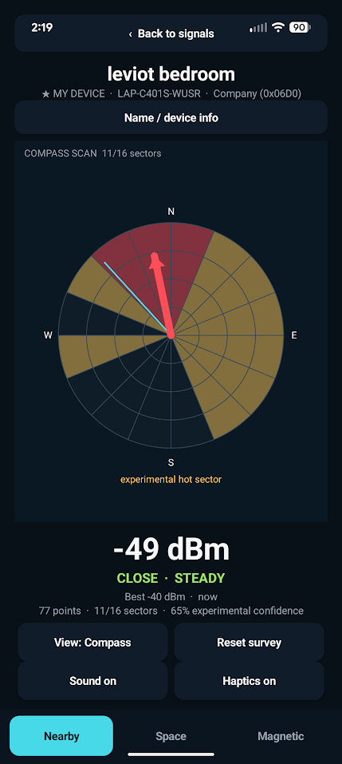
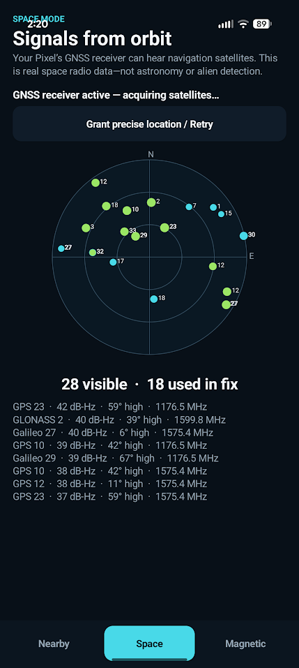
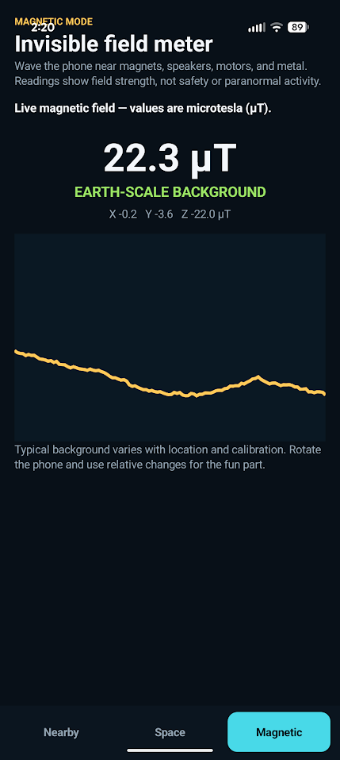
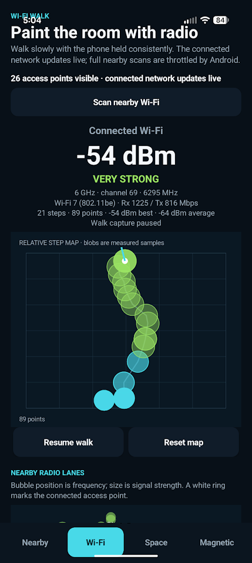

# Find It Fun

> **TL;DR:** This project ended up going beyond Bluetooth and experimenting with
> my phone's sensors. It was only tested on a Pixel phone; everything else is
> likely to break in dramatic fashion. Good luck.
>
> Inspired by [this Bluetooth-finding tweet](https://x.com/un1c0rnioz/status/2084686552299634805)
> and its author's [`findphone` repository](https://github.com/ben-z/findphone),
> Find It Fun is an offline Android app for discovering nearby Bluetooth
> devices, walking a live Wi-Fi signal map, following Bluetooth signals warmer
> or colder, and exploring GNSS satellites and magnetic fields for fun.

<p align="center">
  
  
  
  
</p>

The app keeps all observations on the phone and includes:

- **Nearby:** continuously surveys detectable Bluetooth Low Energy advertisers.
- **Hunt:** tap a device for warmer/colder guidance, proximity clicks, haptics,
  a compass-sector survey, a step-based trail map, and honest stale/lost states.
- **My Devices:** hold a device row or use Name / device info while hunting to
  save a local nickname and inspect manufacturer, service, PHY, transmit-power,
  pairing, and advertisement metadata.
- **Wi-Fi Walk:** paint the connected network's live signal strength onto a
  relative step-and-heading trail, inspect link speed/band/channel/standard,
  and visualize nearby access points across 2.4, 5, and 6 GHz radio lanes.
- **Sound Ping:** emit a short audible chirp, measure the local room response,
  and visualize separated echo delays as experimental omnidirectional distance
  rings and a distance-versus-echo-strength profile.
- **Space:** a live GNSS sky plot with satellite signal strength.
- **Magnetic:** a three-axis magnetic field meter and live history.

Bluetooth devices must be advertising to appear. This app measures signal
strength, not direction, and it does not upload observations.

Wi-Fi Walk is a relative radio survey, not a camera and not through-wall object
imaging. Hold the phone consistently and walk a loop or dogleg around the room.
Colored blobs are measured connected-network RSSI at step-derived positions;
they are not exact meter coordinates. Android heavily throttles repeated full
nearby Wi-Fi scans, but connected-network RSSI and link properties can update
more frequently. Nearby rows marked `RTT` advertise ranging support; this first
version identifies them but does not yet perform Wi-Fi RTT ranging.

Sound Ping is experimental acoustic ranging, not object recognition. A ring
means an echo with that approximate round-trip distance was detected somewhere
around the phone; a single microphone measurement does not reveal its bearing.
Speaker/microphone latency cancels against the directly captured chirp, but
room multipath, automatic audio processing, phone placement, and covered ports
can create false, merged, or missing peaks. One-shot and continuous modes keep
their raw microphone samples only in memory and discard them after analysis.

The Android app has no Internet permission, analytics, advertisements, or user
accounts. See [PRIVACY.md](PRIVACY.md) for its data and permission behavior.

The Hunt compass arrow is an experimental inference: stand still, keep the phone
flat, and rotate slowly through a full circle. It is hidden until enough of the
sweep has samples and one hot sector is clearly stronger than nonadjacent
sectors. The displayed readiness score is a UI heuristic, not a statistical
confidence interval. Trail mode uses heading plus Android's step detector; grant the
Physical activity permission when prompted. A dogleg walk is more informative
than a straight line.

Paired devices remain listed even while silent. Android cannot expose live RSSI
for an idle Classic-only Bluetooth device, so those rows explain the limitation
instead of pretending to track them. Custom names are keyed locally to Android's
hidden device identifier; privacy-preserving devices that rotate identifiers may
occasionally need to be named again.

## Build and install

The project requires Java 17, Android SDK Platform 35, and Android SDK Build
Tools 35.0.0.

### Windows (PowerShell)

From PowerShell in this directory:

```powershell
.\build.ps1
```

That command discovers the Android SDK from `ANDROID_SDK_ROOT`, `ANDROID_HOME`,
or the standard Windows SDK location, and discovers Java from `JAVA_HOME`,
`PATH`, or Android Studio. It runs unit tests, Android lint, assembles the debug
APK, verifies its signature, and copies the final artifact to:

```text
artifacts/finditfun-mvp-debug.apk
```

All Gradle, Android-user, signing, and build state is kept inside this folder.

Enable Developer options and USB debugging, connect the phone, approve its RSA
prompt, then run:

```powershell
.\install.ps1
```

The install script rebuilds and verifies the APK before using `adb install -r`.

### macOS and Linux

Set the Android SDK location if it is not already configured. Android Studio's
usual paths are `$HOME/Library/Android/sdk` on macOS and `$HOME/Android/Sdk` on
Linux:

```bash
# Use this on macOS:
export ANDROID_SDK_ROOT="$HOME/Library/Android/sdk"

# Or use this on Linux:
# export ANDROID_SDK_ROOT="$HOME/Android/Sdk"

export PATH="$ANDROID_SDK_ROOT/platform-tools:$PATH"
```

Make sure `java -version` reports Java 17, or set `JAVA_HOME` to a Java 17 JDK.
Then create the ignored project-local debug key once and build:

```bash
mkdir -p .local
if [ ! -f .local/finditfun-debug.keystore ]; then
  keytool -genkeypair \
    -keystore .local/finditfun-debug.keystore \
    -storepass android -keypass android -alias androiddebugkey \
    -dname "CN=Find It Fun Debug,O=Local Development,C=US" \
    -keyalg RSA -keysize 2048 -validity 10000
fi

chmod +x gradlew
./gradlew --no-daemon testDebugUnitTest lintDebug assembleDebug
```

The APK is written to `app/build/outputs/apk/debug/app-debug.apk`. With USB
debugging enabled and the phone connected, install and launch it with:

```bash
adb install -r app/build/outputs/apk/debug/app-debug.apk
adb shell am start -n com.finditfun.app.debug/com.finditfun.app.MainActivity
```

### Direct Gradle use on Windows

`build.ps1` supplies the discovered Java and Android paths. If those paths are
already in your environment, the usual commands also work:

```powershell
.\gradlew.bat testDebugUnitTest lintDebug assembleDebug
```

## Optional Windows BLE survey helper

`tools/scan_ble.ps1` performs a local BLE scan from a Windows PC and prints the
results as JSON. It uses `uv` to run `tools/scan_ble.py` with Bleak; it does not
save or upload scan results unless you explicitly redirect its output.

## Publishing

Generated APKs, machine-local Android paths, Gradle caches, scan captures, and
debug signing material are ignored by Git. The source is released under the MIT
License; see [LICENSE](LICENSE).

Publish the files selected by Git; do not upload a ZIP of the entire developer
folder. Ignored build reports can contain the computer hostname and absolute
paths, and `.local/` contains the reusable debug signing key for updating a
locally installed debug build.

The product idea was informed by
[`findphone`](https://github.com/ben-z/findphone) and
[`superfind`](https://github.com/p4r1ch4y/superfind). This repository does not
vendor either project or require their source code.
